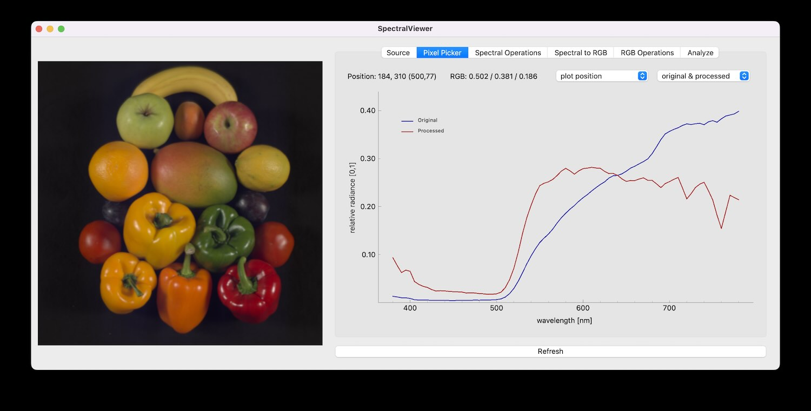

# SpectralViewer
A small graphical tool to view and process spectral images. It loads both RAW (ENVI) images and processed mat files. There are several operations available to edit the image before and after converting it to viewable tristimulus values and seeing its effects.

